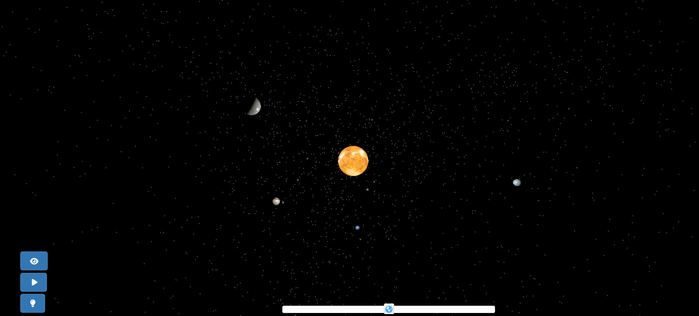

# Le Planetarium

Dans ce planetarium, je déposerai mes projets de développement 3D et autres expérimentations relatifs à l'espace et aux planètes. 

## Le système solaire - voyage dans l'espace

3-2-1 ... Embarquez pour un voyage dans le système solaire !
Découvrez cette première visualisation du système solaire via ce [lien](https://chloepochon.github.io/threeJS/planetarium/solar-system/){:target="_blank"}. Cliquez dessus pour ouvrir la visualisation dans une nouvelle fenêtre.

{:target="_blank"}

Pour accéder au [code source](https://github.com/chloepochon/chloepochon.github.io/blob/main/threeJS/planetarium/solar-system/js/main.js){:target="_blank"}

Ce travail a été développé grâce à la library JavaScript [ThreeJS](https://threejs.org/){:target="_blank"} et repose sur un environnement [Node.js](https://nodejs.org){:target="_blank"}
Les images servant à illustrer la matière des planètes proviennent de ce [site](https://www.solarsystemscope.com){:target="_blank"}.
La musique d'animation, libre de droit : [*Music by RelaxingTime from Pixabay*](https://pixabay.com/fr/users/relaxingtime-17430502/){:target="_blank"}
<!-- Ajoutez d'autres sections et contenus pertinents ici -->

