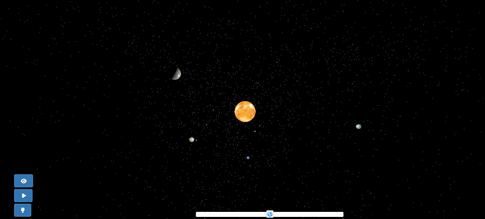

# Présentation du Planetarium

Bienvenue sur la page de présentation du Planetarium ! Ce projet vise à fournir des visualisations relatives aux planètes et à l'espace.

## Visualisation du système solaire

Pour commencer, vous pouvez consulter cette première visualisation du système solaire en utilisant ce [lien](https://chloepochon.github.io/threeJS/planetarium/solar-system/). Cliquez dessus pour ouvrir la visualisation dans une nouvelle fenêtre.

<!-- Ajoutez d'autres sections et contenus pertinents ici -->

